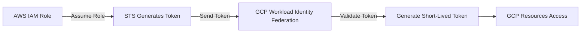

# Secure Access Methods in GCP: Beyond Service Account Keys

## Introduction

Service Account Keys aren't secure. Here are the three ways I'd recommend as alternatives.--> to access GCP resources/ perform operations without relying on static Service Account keys.

## Directory Structure

```
Secure-Alternatives-to-Service-Account-Keys-in-GCP/
│   README.md      
│      
├───impersonation      
│   └───impersonate_sa.py         
│      
├───short-lived-tokens      
│   └───generate_short_lived_token.py      
│      
├───workload-identity-federation      
    └───workload_identity_setup.py
```


## 1. Service Account Impersonation with _gcloud auth print-access-token_

Service Account Impersonation allows a user to temporarily assume the permissions of that Service Account. This method avoids the need for long-lived keys by using short-lived access tokens.

Procedure:-

1. **Authenticate and Configure gcloud**:

   Make sure your gcloud CLI is authenticated and configured with the required IAM roles.
   ```bash
   gcloud auth login
   gcloud config set project [PROJECT_ID]
   ```

2. **Grant the `serviceAccountTokenCreator` Role**:

   Ensure the user or service account has the `roles/iam.serviceAccountTokenCreator` role for the target service account.
   ```bash
   gcloud iam service-accounts add-iam-policy-binding [TARGET_SA_EMAIL] \
       --member="user:[YOUR_USER_EMAIL]" \
       --role="roles/iam.serviceAccountTokenCreator"
   ```

3. **Generate Access Token Using gcloud**:

   Use the following command to generate an access token for the target service account.
   ```bash
   ACCESS_TOKEN=$(gcloud auth print-access-token [TARGET_SA_EMAIL])
   echo $ACCESS_TOKEN
   ```

4. **Use the Access Token**:

   Use the generated access token to authenticate API requests.
   ```bash
   curl -H "Authorization: Bearer $ACCESS_TOKEN" \
        https://www.googleapis.com/auth/cloud-platform
   ```

Using Service Account Impersonation with `gcloud auth print-access-token` provides a secure way to access GCP resources without long-lived keys. This ensures better security and compliance.

---

## 2. Generating Short-Lived Tokens

Short-lived tokens provide temporary access and reduce the risk of credential leakage. This creates cre

### Code Snippet

```python
from google.oauth2 import service_account

# Load the source credentials
source_credentials = service_account.Credentials.from_service_account_file('path/to/source/key.json')

# Generate an access token
access_token = source_credentials.get_access_token().token

print("Access Token:", access_token)
```

## 3. Workload Identity Federation

Workload Identity Federation allows GCP to trust identities from external identity providers (IdPs) like AWS, Azure, or on-premises systems. This means you can use external identities to authenticate to GCP services without managing long-lived SA keys.

## How It Works

Simple workflow to illustrate the process:

1. The user or application uses an external identity from a trusted IdP (e.g., AWS IAM role).
2. GCP validates the external identity through Workload Identity Federation.
3. A short-lived token is generated for the GCP Service Account.
4. The token is used to access GCP resources securely.

### Workflow Diagram



## Setting Up Workload Identity Federation

Let's set up WIF using AWS as the external IdP:

### Step 1 --> Configure AWS IAM Role

**Create IAM Role**: Create an IAM role in AWS with the necessary permissions.

**Trust Relationship**: Set up the trust relationship to allow GCP to assume the role.
```json
{
  "Version": "2012-10-17",
  "Statement": [
    {
      "Effect": "Allow",
      "Principal": {
        "Federated": "accounts.google.com"
      },
      "Action": "sts:AssumeRoleWithWebIdentity"
    }
  ]
}
```

### Step 2: Set Up Workload Identity Pool in GCP

**Create Identity Pool**: Create a Workload Identity Pool in GCP.
```sh
gcloud iam workload-identity-pools create "my-pool" \
  --project="my-project" \
  --location="global" \
  --display-name="My Pool"
```

**Create Provider**: Create a Workload Identity Provider within the pool.
```sh
gcloud iam workload-identity-pools providers create-aws "my-provider" \
  --location="global" \
  --workload-identity-pool="my-pool" \
  --account-id="aws-account-id" \
  --region="us-west-2"
```

### Step 3: Grant IAM Permissions

**Bind IAM Policy**: Bind the GCP Service Account to the Workload Identity Pool.
```sh
gcloud iam service-accounts add-iam-policy-binding "my-service-account@my-project.iam.gserviceaccount.com" \
  --role="roles/iam.workloadIdentityUser" \
  --member="principal://iam.googleapis.com/projects/my-project/locations/global/workloadIdentityPools/my-pool/subject/aws-role-arn"
```

### Step 4: Authenticate Using AWS Role

**Assume Role**: Assume the IAM role in AWS and obtain the token.

**Exchange Token**: Exchange the token for a GCP access token.
```python
import google.auth
from google.auth import impersonated_credentials
from google.auth.transport.requests import Request
from subprocess import check_output

def get_impersonated_access_token(target_sa_email):
    # Command to generate the impersonated access token
    command = [
        "gcloud", "auth", "print-access-token", f"--impersonate-service-account={target_sa_email}"
    ]
    access_token = check_output(command).strip().decode("utf-8")
    return access_token

if __name__ == "__main__":
    target_sa_email = "target-sa@example.iam.gserviceaccount.com"
    token = get_impersonated_access_token(target_sa_email)
    print("Impersonated Access Token:", token)
```


## Conclusion

By using these secure methods, we can minimize the risks associated with long-lived Service Account keys while maintaining the ability to interact with GCP resources.

Feel free to explore the repository and try out the code. Let's ensure our applications are secure and efficient!

---

Let's connect and discuss more about cloud security and efficient resource management in GCP. Happy coding!

